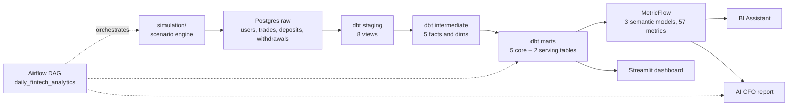

# Fintech Analytics AI

An end-to-end analytics engineering portfolio for a simulated retail trading broker: dbt marts, a MetricFlow semantic layer, Airflow orchestration and a guardrailed AI BI layer.

**[Read the full documentation site](https://tsiagg.github.io/fintech-analytics-ai/)**

<!-- Hero screenshot slot: uncomment once this image exists

-->

---

## What this is

A complete analytics stack that turns trades, client funding, signups, affiliate acquisition costs and regional targets into decision-ready data. A simulator writes daily activity into Postgres. dbt transforms it into tested marts and a semantic layer of 57 governed metrics. Airflow runs the pipeline, and Streamlit presents the results through an executive dashboard, a chat-based BI assistant and an automatically generated CFO report.

The core of the project is the trust layer underneath the app: **define metrics once, test them, and make them the only numbers an LLM is allowed to discuss.**

## Business questions covered

- How do company P&L, per-lot trading costs, cashback and affiliate costs combine into net revenue?
- Are active users, deposits and net revenue on target by region?
- Which acquisition channels, customer groups and instruments drive commercial performance?
- Are withdrawal behaviour, funding flows or daily results showing unusual movement?
- Are clients activating and returning after signup?

The [Skills page](https://tsiagg.github.io/fintech-analytics-ai/06-skills.html) connects these questions to the technical, business and collaboration skills demonstrated in the repository.

## Architecture

## The trust model

Every number is computed in the warehouse. The LLM never writes SQL and never sees the database. It receives a validated result set and is asked to explain it. A question is turned into a plan of allowlisted metric and dimension names, the plan is validated against the semantic catalog before anything runs, and MetricFlow executes it. If a metric is not defined in YAML, it cannot be asked for.

## Stack

Postgres 16, dbt Core with `dbt_utils`, MetricFlow, Airflow 3.1.5 on LocalExecutor, Streamlit with Plotly, OpenRouter for the LLM layer, all running locally under Docker Compose.

## Ownership, honestly

I own the analytics engineering: the dimensional models, grain decisions, business definitions, tests and guardrail design that constrains the AI. The simulator stands in for an upstream data engineering team. The Streamlit and larger Python application modules were built with an AI coding agent under my direction and review.

That split, the review process and the project's current boundaries are documented in [Ownership and Cursor workflow](https://tsiagg.github.io/fintech-analytics-ai/05-ownership-and-cursor-workflow.html) and [Skills](https://tsiagg.github.io/fintech-analytics-ai/06-skills.html).

## A 60-second tour

If you only open five files, open these:

- [`dbt/models/marts/mrt_daily_user_activity.sql`](dbt/models/marts/mrt_daily_user_activity.sql) — the core mart, at user x day grain
- [`dbt/models/semantic_models/metrics.yml`](dbt/models/semantic_models/metrics.yml) — 57 metrics: simple, ratio, cumulative and derived
- [`dbt/models/marts/marts.yml`](dbt/models/marts/marts.yml) — the documentation and grain tests that make the marts trustworthy
- [`app/services/metrics.py`](app/services/metrics.py) — the validation gate every AI-planned query has to pass
- [`infra/airflow/dags/daily_fintech_analytics.py`](infra/airflow/dags/daily_fintech_analytics.py) — the daily pipeline

A guided tour of the rest, including what to skip, is in the [file guide](https://tsiagg.github.io/fintech-analytics-ai/07-file-guide.html).

## Status

Phases 1 to 4 are complete: raw simulation, dbt core and semantic layers, Airflow orchestration, and all four Streamlit surfaces. Phase 5 was scoped as portfolio packaging and deliberately stopped at documentation rather than adding a hosted demo. Progress is tracked in [ROADMAP.md](model-implementation-planning/ROADMAP.md) and open ideas in [IMPROVEMENTS.md](model-implementation-planning/IMPROVEMENTS.md).

## Running it

`docker compose -f infra/docker-compose.yml up -d` brings up Postgres and Airflow. The dashboard runs without an LLM key; only the BI Assistant and CFO report need one. Full steps are in [Run it yourself](https://tsiagg.github.io/fintech-analytics-ai/08-run-it-yourself.html) and the operational detail in [docs/runbook.md](docs/runbook.md).
