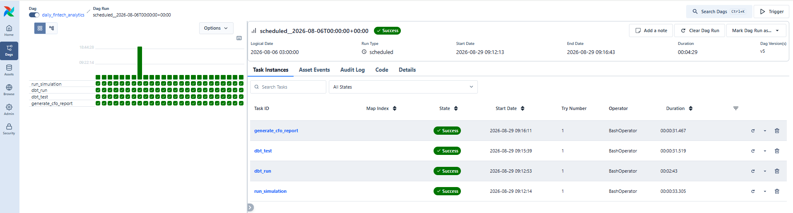
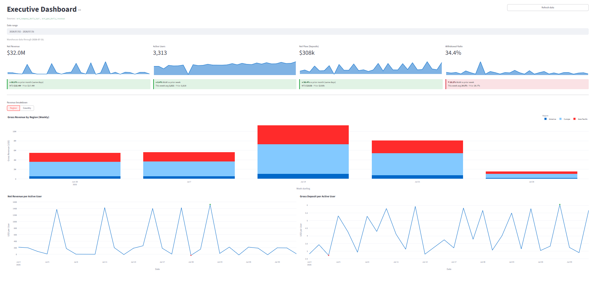

# What I built

Four user-facing surfaces sitting on one tested warehouse, refreshed by one daily pipeline. Each surface exists to demonstrate a different thing.

## The daily pipeline

One Airflow DAG, [`daily_fintech_analytics`](https://github.com/tsiagg/fintech-analytics-ai/blob/main/infra/airflow/dags/daily_fintech_analytics.py), runs four tasks in sequence:

`run_simulation` generates one day of source data, `dbt_run` rebuilds the models, `dbt_test` gates the result, and `generate_cfo_report` writes an executive report for that date.

<!-- Screenshot slot: uncomment once the file exists. See assets/screenshots/CAPTURE-GUIDE.md

-->

Two configuration choices matter more than the task list. `depends_on_past=True` with `catchup=True` means a gap in history backfills strictly one day at a time and in order, which is required because the simulator's user lifecycle depends on prior days. And `dbt_test` is its own task rather than a flag on the run, so a failing grain test stops the pipeline **before** the CFO report is generated from bad numbers.

## Executive dashboard

<!-- Screenshot slot: uncomment once the file exists. See assets/screenshots/CAPTURE-GUIDE.md

-->

A conventional BI surface: four KPI cards with sparklines, month-to-date and week-over-week comparison badges, a weekly revenue breakdown that toggles between region and country, and per-user trend lines.

It reads the serving marts directly rather than going through the semantic layer, because a dashboard has fixed, known queries and does not need runtime metric resolution. It falls back to mock data when Postgres is unavailable so the app still demos on a laptop with nothing running.

**What it demonstrates:** that the marts are shaped for consumption, and that I can decide which comparisons actually help an executive rather than putting every column on screen.

## BI Assistant

<!-- Screenshot slot: uncomment once the file exists. See assets/screenshots/CAPTURE-GUIDE.md

-->

A chat interface for ad-hoc questions. You ask "what drove the withdrawal spike last week" and it answers with a chart, a table, and a written explanation.

What it does *not* do is generate SQL. The question is turned into a plan naming metrics and dimensions from an allowlist, the plan is validated, MetricFlow executes it, and only then does an LLM see the numbers. Period-over-period comparisons and anomaly scans are computed in pandas, not asked of the model. The full chain is described in [BI implementation strategy](04-bi-implementation-strategy.md).

It routes cheap questions to a fast model and analytical ones ("why", "compare", "anomaly") to a stronger one, and shows the model and token count under every answer so cost stays visible.

**What it demonstrates:** guardrail design. Making an LLM useful over a warehouse without letting it invent numbers is a design problem, not a prompting problem.

## AI CFO report

<!-- Screenshot slot: uncomment once the file exists. See assets/screenshots/CAPTURE-GUIDE.md

-->

A nine-section executive report, generated on a schedule rather than on request: executive summary, trends against target, revenue, user activity, cash flow, regional performance, risks, forecast, and recommended actions.

Every quantitative element is computed in Python before the LLM is involved. Month-end projections come from a linear regression with a run-rate fallback ([`reporting/forecasting.py`](https://github.com/tsiagg/fintech-analytics-ai/blob/main/reporting/forecasting.py)), anomalies from z-scores plus explicit business rules ([`reporting/anomalies.py`](https://github.com/tsiagg/fintech-analytics-ai/blob/main/reporting/anomalies.py)). The model writes the prose around those facts and nothing else. Output is stored as HTML in Postgres and the Streamlit page just renders the latest one.

[Open a real generated report](cfo_report_latest.html).

**What it demonstrates:** the difference between reactive and proactive analytics, and that a report worth reading needs a fixed structure with deterministic inputs, not a one-shot prompt.

## Data spot check

<!-- Screenshot slot (optional): uncomment once the file exists. See assets/screenshots/CAPTURE-GUIDE.md

-->

The least glamorous page and the one I use most. It dumps the marts with a date filter and a CSV export.

It exists because when a dashboard number looks wrong, the first question is always whether the mart is wrong or the dashboard is. This page answers that in about ten seconds, and it is how I reconcile the app against the warehouse after every change.

**What it demonstrates:** that I build the boring tool that makes debugging possible instead of trusting the pretty one.
