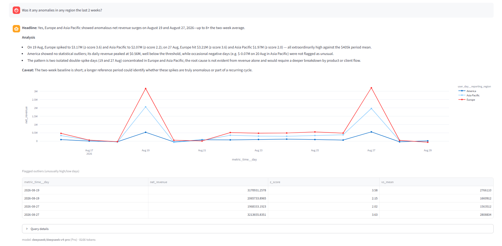
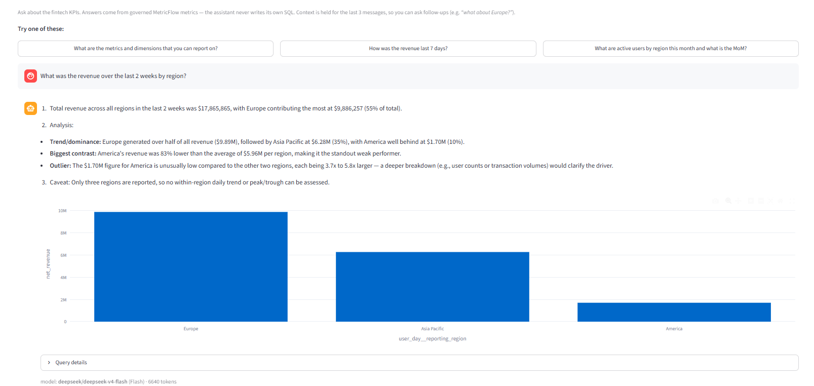

# What I built

Four user-facing surfaces sitting on one tested warehouse, refreshed by one daily pipeline. Each surface exists to demonstrate a different thing.

## The daily pipeline

Problem If tests are optional, a bad grain join can still reach an executive report.

Approach One daily Airflow DAG, sequential backfill, and <code>dbt_test</code> as its own gate before anything is published.

What I built <code>daily_fintech_analytics</code>: <code>run_simulation</code> → <code>dbt_run</code> → <code>dbt_test</code> → <code>generate_cfo_report</code>.

Why it matters A failing grain test stops the pipeline before the CFO report is generated from bad numbers.

Airflow · dbt Core · Postgres

One Airflow DAG, [`daily_fintech_analytics`](https://github.com/tsiagg/fintech-analytics-ai/blob/main/infra/airflow/dags/daily_fintech_analytics.py), runs four tasks in sequence:

`run_simulation` generates one day of source data, `dbt_run` rebuilds the models, `dbt_test` gates the result, and `generate_cfo_report` writes an executive report for that date.

Two configuration choices matter more than the task list. `depends_on_past=True` with `catchup=True` means a gap in history backfills strictly one day at a time and in order, which is required because the simulator's user lifecycle depends on prior days. And `dbt_test` is its own task rather than a flag on the run, so a failing grain test stops the pipeline **before** the CFO report is generated from bad numbers.

## Executive dashboard

Problem An executive does not need every column. They need a few comparisons that answer whether activity, revenue and funding are on plan.

Approach Shape serving marts for known queries. Pick KPIs and period comparisons that support a decision, not a gallery of charts.

What I built Four KPI cards with sparklines, month-to-date and week-over-week badges, a weekly revenue breakdown that toggles between region and country, and per-user trend lines.

Why it matters The marts are fit for consumption, and things can be left off the screen.

Python · SQL · Streamlit

It reads the serving marts directly rather than going through the semantic layer, because a dashboard has fixed, known queries and does not need runtime metric resolution. It falls back to mock data when Postgres is unavailable so the app still demos on a laptop with nothing running.

## BI Assistant

Problem Ad-hoc questions about warehouse numbers are useful. Letting a model write SQL against raw tables produces confident, plausible, wrong answers.

Approach The question becomes a plan naming metrics and dimensions from an allowlist. The plan is validated, MetricFlow executes it, pandas does period-over-period and anomaly arithmetic, and only then does an LLM see the numbers.

What I built A chat surface that returns a chart, a table and an explanation. Cheap questions stay on a fast model; anomaly and root-cause questions escalate. Neither model writes SQL.

Why it matters Guardrails and cost routing without letting either model invent a business number.

MetricFlow · Python · pandas

The full chain is described in [BI implementation strategy](04-bi-implementation-strategy.md).

A straightforward descriptive question stays on the cheap model. The badge under the answer shows `deepseek-v4-flash` and the token count.

Ask about anomalies or root cause and the router escalates to the stronger model — that is the screenshot at the top of this section. Same MetricFlow numbers, same chart and table; only the explainer tier changes. The badge there shows `deepseek-v4-pro`.

## AI CFO report

Problem Leadership still needs a structured view of what happened when nobody typed a question.

Approach A fixed nine-section report, generated on a schedule. Every quantitative element is computed in Python before the LLM is involved.

What I built An Airflow task that writes the HTML report to Postgres, and a Streamlit page that renders the latest one.

Why it matters A report worth reading needs deterministic inputs and a template, not a one-shot prompt.

Airflow · Python · Jinja2

The nine sections are: executive summary, trends against target, revenue, user activity, cash flow, regional performance, risks, forecast, and recommended actions.

Month-end projections come from a linear regression with a run-rate fallback ([`reporting/forecasting.py`](https://github.com/tsiagg/fintech-analytics-ai/blob/main/reporting/forecasting.py)), anomalies from z-scores plus explicit business rules ([`reporting/anomalies.py`](https://github.com/tsiagg/fintech-analytics-ai/blob/main/reporting/anomalies.py)). The model writes the prose around those facts and nothing else.

[Open a real generated report](cfo_report_latest.html).

## Data spot check

Problem When a dashboard number looks wrong, the first question is whether the mart is wrong or the dashboard is.

Approach A dedicated page that dumps the marts with a date filter and a CSV export.

What I built Data Spot Check — the least glamorous page and the one I use most.

Why it matters Reconciliation in about ten seconds, after every change, instead of trusting the pretty surface.

Streamlit · SQL

