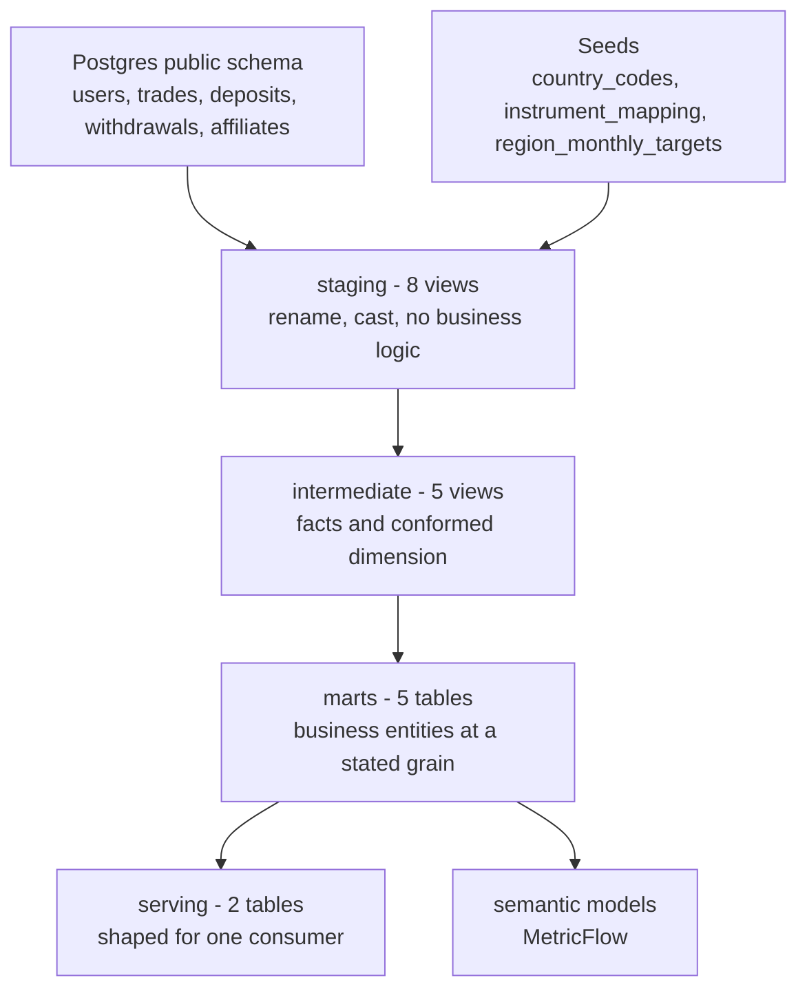

# Architecture and data model

Twenty-one dbt models across four layers, each layer with one job.

## Why the layers are split this way

<!-- Screenshot slot: uncomment once the file exists. See assets/screenshots/CAPTURE-GUIDE.md

-->

**Staging** is one view per source object. Renaming, casting, light cleaning, nothing else. Five views over the raw `public` tables and three over seeds. The rule is that if you need to understand the business to read a staging model, the logic is in the wrong place.

**Intermediate** is where business logic actually happens, and it is split by process rather than by output. [`int_fct_daily_trading`](https://github.com/tsiagg/fintech-analytics-ai/blob/main/dbt/models/intermediate/int_fct_daily_trading.sql) handles trading economics, `int_fct_daily_funding` handles cash movement, `int_fct_affiliates_cost` handles acquisition cost, and `int_dim_users` is the conformed user dimension. They are separate because they have different grains and different failure modes; a bug in cashback logic should not be tangled up with a bug in withdrawal handling. `int_fct_daily_user_activity` then combines them onto one spine.

**Marts** are the business entities, each at a grain I state explicitly and then test. **Serving** models are deliberately narrower: they exist to serve one consumer, and I am comfortable denormalising them because they are cheap to rebuild.

## The models and their grain

Core marts:

- `mrt_daily_user_activity` — **user x day**. The workhorse: trading revenue, funding flows and affiliate cost per customer per day.
- `mrt_user_lifetime` — **user**. Cumulative value and activity across all loaded history.
- `mrt_user_retention` — **user**. Signup cohort plus return-to-activity flags at day 0, 1, 7 and 30.
- `mrt_company_monthly_performance` — **region x month**. Actuals against the plan held in the `region_monthly_targets` seed.
- `mrt_instrument_daily_kpi` — **day x region x symbol**. Volume, trade count and revenue by instrument.

Serving marts:

- `mrt_company_daily_kpi` — **day**. Company-wide executive KPIs for the dashboard.
- `mrt_geo_daily_revenue` — **day x country**. Country grain, with region aggregated in the app rather than in a second model.

Grain is not a comment, it is a test. Seven `dbt_utils.unique_combination_of_columns` tests assert these grains, so a duplicate-producing join upstream fails the pipeline instead of quietly doubling revenue.

## Materialization

Staging and intermediate are **views**; marts, serving and the semantic layer are **tables**. Views cost nothing to maintain and always reflect the source, which is what you want for thin transformation layers. Marts get read repeatedly by dashboards and by MetricFlow, so they are materialized. The whole warehouse is small enough to rebuild daily in full, so there is no incremental logic anywhere — adding it would be complexity without a problem to solve.

## Exposures

Two dbt exposures declare who consumes what: `streamlit_executive_dashboard` on the serving marts and `airflow_generate_cfo_report` on the core marts. They cost two YAML blocks and mean the lineage graph answers "what breaks if I change this model" without me having to remember.

## Where the data comes from

The `public` schema is populated by a scenario-driven simulator in [`simulation/`](https://github.com/tsiagg/fintech-analytics-ai/tree/main/simulation), which writes `users`, `trades`, `deposits` and `withdrawals` one day at a time, with `affiliates` seeded once as a dimension.

Six named scenarios control each day's character: `stable_market`, `high_volatility`, `market_crash`, `marketing_campaign`, `technical_problem` and `holiday_lull`. A day is drawn from weighted probabilities unless overridden, so history contains occasional crashes and outages, which is what makes anomaly detection and variance analysis worth building. Runs are idempotent per date: rerunning a day deletes and regenerates it.

**This is the part of the stack I did not build and do not claim.** It stands in for the data engineering team and the upstream product. I treat it exactly as I would treat a real source system: I read its schema, I do not modify it, and everything I own starts at the staging layer. It is written up honestly in [Ownership and Cursor workflow](05-ownership-and-cursor-workflow.md).
