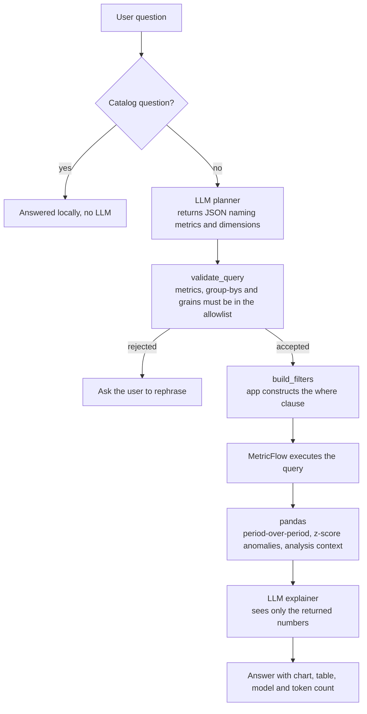

# BI implementation strategy

How I think AI should be put in front of a warehouse, and what I actually implemented to test the opinion.

## The principle

**The warehouse computes. The model narrates.** An LLM is good at turning a table into a sentence a stakeholder will read, and bad at being a calculator you can audit. So it never touches SQL, never sees the database, and only ever receives a result set that a governed query produced.

This is a constraint, not a limitation to be engineered around later. The moment a model can write its own SQL, the definition of net revenue becomes whatever the model decided this time, and no test in your dbt project protects you.

## Two AI surfaces, deliberately separate

**Reactive — the BI Assistant.** Someone has a question now. Unpredictable input, one question at a time, needs to be fast and cheap.

**Proactive — the AI CFO report.** Nobody asked. It runs on a schedule and tells you what happened. Fixed structure, known queries, quality matters more than latency.

These are different products and I built them separately. A single "AI analyst" trying to be both ends up as a one-shot planner attempting a nine-section report, which is exactly the failure I ran into and wrote up as item I-3 in the backlog. The report is not a big question; it is a template of sections, each backed by pre-defined queries, stitched together.

## The guardrail chain

Each link in that chain removes a way the system could lie.

**The catalog is generated, not written.** [`app/services/semantic.py`](https://github.com/tsiagg/fintech-analytics-ai/blob/main/app/services/semantic.py) parses the same MetricFlow YAML that dbt uses. There is no second list of metrics to drift out of sync — if a metric is not in the semantic layer, the assistant does not know it exists.

**The plan is validated before anything runs.** [`validate_query`](https://github.com/tsiagg/fintech-analytics-ai/blob/main/app/services/metrics.py) checks every metric name against the catalog and every group-by against the *intersection* of what all requested metrics support. That intersection matters: asking for two metrics that do not share a dimension is a question with no valid answer, and it is better to say so than to return a join that looks fine.

**Filters are built by the app, not the model.** The planner supplies a dimension, an operator and a value. The operator has to be one of six allowed ones, and the app assembles the MetricFlow `where` expression itself. The model never emits filter syntax.

**Arithmetic is not delegated.** Period-over-period comparisons and the z-score anomaly scan happen in pandas. Asking a language model to compute a week-over-week change is asking for a plausible-looking wrong number.

**The explainer sees facts, not access.** By the time the second LLM call happens, its entire world is the returned table plus a computed context block of peaks, troughs, movers and outliers. It cannot fetch anything else.

## Cost control

Questions default to a fast, cheap model. Analytical phrasing — "why", "compare", "anomaly", "deep dive" — escalates to a stronger one. If the planner returns unparseable JSON, it retries on the other tier rather than failing. Every answer displays the model used and the token count, which keeps the running cost visible instead of arriving as a monthly surprise. The whole thing was built to a roughly 20 euro per month budget.

Two known inefficiencies are logged rather than hidden: the retry is more eager than it needs to be (I-7), and the catalog sent to the planner is not trimmed by relevance, so very broad questions can crowd the context window (I-5).

## What I would do differently on a real team

**Execution.** MetricFlow is invoked here by shelling out to the `mf` CLI and parsing CSV. That is a pragmatic choice for a local project and it is not what I would ship. It costs a process spawn per query and has no connection pooling. In a company I would go through a semantic layer API.

**The allowlist becomes a governance surface.** In this project the metric catalog is a safety mechanism. In a real organisation it is also the contract between the analytics engineering team and every consumer, AI or not. That is an argument for the semantic layer to be the interface the BI tool uses too, rather than a special path built for the chatbot.

**Logging and feedback.** Nothing here persists which questions were asked, which plans failed validation, or whether the answer was useful. That log is the highest-value thing you could add: it tells you which metrics people actually want, and every rejected plan is a request for a metric that does not exist yet.

**Attribution over description.** The assistant explains what a number did. The genuinely useful version explains what drove it — ranking clients and regions by their contribution to a change. That is scoped in the backlog as I-11, and it is blocked on a per-client volume mart rather than on anything about the AI.

## What I left out on purpose

No text-to-SQL, for the reasons above. No API service layer, because the Streamlit app can query marts directly and a FastAPI tier would have been architecture for its own sake. No dbt Cloud Semantic Layer, since MetricFlow on dbt Core does the job without a subscription. And no pipeline health page in the app — Airflow already has a good one, and rebuilding it would have been demo work, not analytics work.
