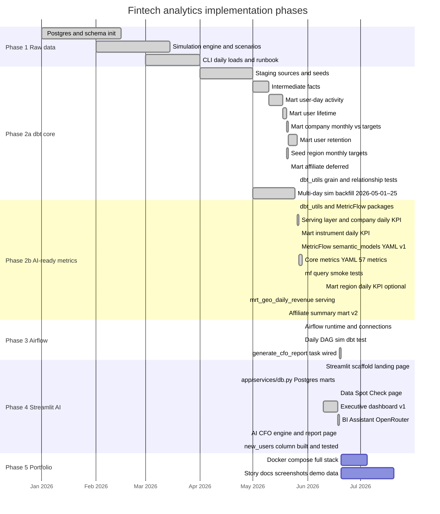
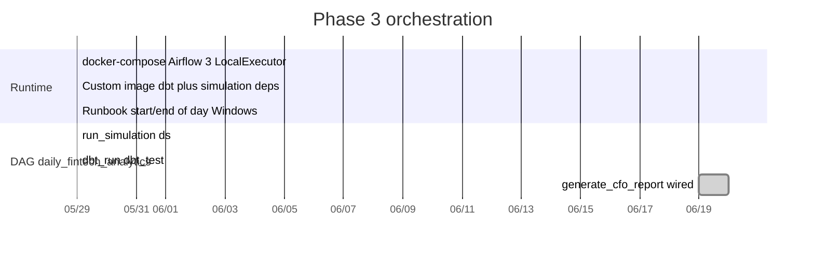
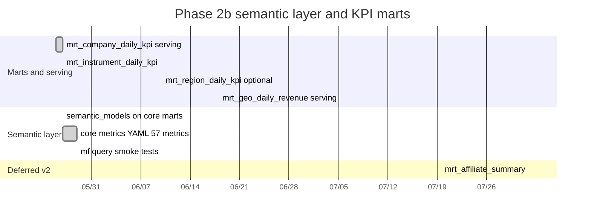

# Implementation roadmap (visual progress)

**Last updated:** 2026-06-20 — **Phases 1–4 effectively complete.** `generate_cfo_report` is now a wired task in the Airflow DAG (`reporting.generate`), and the `new_users` column on `mrt_company_daily_kpi` has been built and tested by dbt (verified in `target/run_results.json`, documented in `serving.yml` with a `not_null` test). AI CFO, BI Assistant, Executive Dashboard v1, and Data Spot Check are all live. **Next:** Phase 5 portfolio packaging (root README, architecture diagram, full-stack compose, sample backfill, screenshots). Edit the [Progress tracker](#progress-tracker) when you finish work.

**You are here:** **Phase 4 ~100%** — Streamlit app at **http://localhost:8501** with **Data Spot Check** + **Executive Dashboard** + **BI Assistant** + **AI CFO** (Airflow-generated structured report). **Phase 3 complete** (Airflow `daily_fintech_analytics`: `run_simulation → dbt_run → dbt_test → generate_cfo_report`). Only **Phase 5** (portfolio) remains.

---

## Agreed plan (summary)

| Phase | Focus |
|-------|--------|
| **2a** | dbt staging → intermediate → core marts *(done)* |
| **2b** | KPI marts + **serving** rollups + **MetricFlow** on core marts; affiliate mart deferred |
| **3** | **One simple DAG:** sim → `dbt run` → `dbt test` → `generate_cfo_report` *(CFO task now wired)* | *(done)* |
| **4** | Streamlit: **Dashboard** + **BI Assistant** + **AI CFO**; OpenRouter (~€20/mo); metrics from marts/semantic layer only |
| **5** | Portfolio storytelling, README, compose, screenshots (incl. Airflow DAG), sample backfill — no new product features |

**Design principles:** Compute metrics in the warehouse; AI interprets only. Separate BI Assistant (reactive) from AI CFO (proactive, structured). Scale by adding marts + semantic metric YAML later.

---

## Overall progress

```text
Phase 1   [████████████████████] 100%  Done
Phase 2a  [████████████████████] 100%  Done
Phase 2b  [████████████████████] 100%  Done
Phase 3   [████████████████████] 100%  Done (CFO task wired into DAG)
Phase 4   [████████████████████] 100%  Done (dashboard + BI Assistant + AI CFO + new_users)
Phase 5   [░░░░░░░░░░░░░░░░░░░░]   0%  Not started
─────────────────────────────────────────────
Portfolio (weighted*)     [██████████████████░░]  ~90%
```

\*Weighted estimate: Phase 1 = 12%, Phase 2 (2a+2b) = 38%, Phase 3 = 18%, Phase 4 = 22%, Phase 5 = 10%. Adjust weights in this file if priorities differ.

---

## Gantt chart (Mermaid)

Renders in GitHub, many IDEs, and Cursor markdown preview. **Green/done** = complete; **blue/active** = current focus; **grey** = not started.



### Phase 3 detail (shipped v1)



### Phase 2b detail (complete)



---

## Progress tracker

Update **`%`** and **`Status`** when you complete items.

| Phase | Focus | % | Status | Notes |
|-------|--------|---|--------|-------|
| **1** | Simulation + Postgres raw | **100** | Done | [phase-1/README.md](./phase-1/README.md) |
| **2a** | dbt core marts | **100** | **Done** | 4 core marts + retention, seeds, `dbt_utils` grain tests — [phase-2/README.md](./phase-2/README.md) |
| **2b** | KPI marts + serving + semantic layer | **100** | **Done** | 57 metrics; `dbt parse` + `mf query` smoke tests OK — [phase-2/README.md](./phase-2/README.md#mf-query-smoke-tests-validated) |
| **3** | Airflow (one DAG) | **100** | **Done** | Airflow 3.1.5, `daily_fintech_analytics` (sim → run → test → `generate_cfo_report`), catchup from **2026-05-29** — [phase-3/README.md](./phase-3/README.md) · runbook |
| **4** | Streamlit + BI + CFO | **100** | **Done** | Dashboard v1 + Data Spot Check + **BI Assistant** + **AI CFO** (Airflow-generated, `reporting/` package) live; `new_users` column built + tested — [phase-4/README.md](./phase-4/README.md) |
| **5** | Portfolio storytelling | **0** | Not started | Screenshots + README; light scope — [phase-5/README.md](./phase-5/README.md) |

### Phase 2a checklist — **done (100%)**

| Work item | Status |
|-----------|--------|
| dbt project + staging (public + seed) | Done |
| Seeds + seed YAML tests | Done |
| Intermediate (5 models) | Done |
| Documentation (staging/intermediate/marts) | Done |
| `mrt_daily_user_activity` | Done |
| `mrt_user_lifetime` | Done |
| `mrt_company_monthly_performance` + `region_monthly_targets` | Done |
| `mrt_user_retention` (user grain; cohort curves via BI aggregation) | Done |
| `dbt_utils` package + grain/uniqueness tests | Done |
| `relationships` test: `int_fct_daily_trading.user_id` → `int_dim_users` | Done |
| Full `dbt test` suite (core; 56 tests at 2a sign-off) | Done |
| `mrt_daily_affiliate` | **Deferred** (v2) |
| `mrt_cohort_retention` (pre-aggregated) | **Optional** — user mart sufficient for v1 |
| Multi-day simulation backfill | **Done** — **2026-05-01 → 2026-05-25** (25 days; verified in `trades` + `mrt_daily_user_activity`) |

### Phase 2b checklist — **done (100%)**

| Work item | % of 2b | Status |
|-----------|---------|--------|
| `dbt_utils` (`packages.yml`) + `dbt deps` | 5 | **Done** |
| `dbt-metricflow[dbt-postgres]` + `mf` CLI (pip) | 10 | **Done** |
| **Serving layer** (`models/serving/`, `dbt_project.yml` tags) | 5 | **Done** |
| `mrt_company_daily_kpi` in `serving/streamlit_dashboard/` | 25 | **Done** (+ per-user columns in SQL) |
| `mrt_geo_daily_revenue` (country grain; region aggregated in Streamlit) | — | **Done** (2026-06-18) |
| `mrt_instrument_daily_kpi` (symbol × **region** × day, core mart) | 10 | **Done** |
| Full `dbt test` suite (**77** tests incl. marts/serving) | 5 | **Done** |
| `semantic_models` on core marts (user-day, company monthly, instrument region × symbol × day) | 15 | **Done** |
| Core metrics YAML (**57** metrics: simple, ratio, cumulative, derived) | 20 | **Done** |
| `dbt parse` / semantic manifest validation | 5 | **Done** |
| `mrt_region_daily_kpi` (optional v1) | 5 | **Deferred v1** — use user-day + monthly regional |
| `mf query` smoke tests + runbook samples | 5 | **Done** |
| **Phase 2b total** | **100** | **Done** |

**v2 (after Phase 4):** `mrt_affiliate_summary`, additional serving models per app folder, extra semantic metrics — add YAML/tables only; no app rewrite.

### Phase 3 checklist — **done (100%)**

| Work item | Status |
|-----------|--------|
| Extend `infra/docker-compose.yml` (fintech Postgres + Airflow 3) | **Done** |
| LocalExecutor stack (apiserver, scheduler, dag-processor, metadata Postgres) | **Done** |
| Custom image (`infra/airflow/Dockerfile`) — dbt + psycopg2 | **Done** |
| DAG `daily_fintech_analytics`: `run_simulation` → `dbt_run` → `dbt_test` | **Done** |
| `catchup=True`, `max_active_runs=1`, `start_date` **2026-05-29** | **Done** |
| Docker dbt profile (`infra/airflow/dbt/profiles.yml`) | **Done** |
| Runbook — Windows start/end of day + Airflow section | **Done** |
| First green DAG run (**2026-05-29**) validated | **Done** |
| `generate_cfo_report` task (`reporting.generate`, runs after `dbt_test`) | **Done** (2026-06-19) |
| 30–60 day portfolio backfill script | **Deferred** → Phase 5 (catchup covers daily gaps) |

### Phase 4 checklist — **done (100%)**

| Work item | Status |
|-----------|--------|
| Streamlit scaffold (`app/main.py`, `app/requirements.txt`) + nav landing | **Done** |
| Start/stop runbook section (`docs/runbook.md`) | **Done** |
| `app/services/db.py` — Postgres → `analytics_dev` marts + geo loader | **Done** |
| **`0_Data_Spot_Check.py`** — mart tables, date filter, CSV export | **Done** (2026-06-18) |
| **`mrt_geo_daily_revenue`** serving mart (country grain) | **Done** (2026-06-18) |
| **Executive Dashboard v1** — see [shipped scope](#executive-dashboard-v1-shipped-2026-06-18) | **Done** |
| **BI Assistant (OpenRouter)** — see [shipped scope](#bi-assistant-shipped-2026-06-19) | **Done** (2026-06-19) |
| `.env` OpenRouter config + `python-dotenv` loading | **Done** |
| `services/semantic.py` (allowlist), `metrics.py` (MetricFlow runner), `ai_client.py`, `bi_engine.py` | **Done** |
| `user_id` dimension added to `daily_user_activity` semantic model | **Done** (2026-06-19) |
| AI CFO — 9-section structured HTML report (`reporting/` package, Airflow `generate_cfo_report`, stored in `analytics_dev.cfo_report_runs`, embedded by `3_AI_CFO.py`) | **Done (2026-06-19)** |
| `reporting/forecasting.py` (numpy.polyfit + run-rate) / `reporting/anomalies.py` (z-score + rule flags) | **Done** |
| `new_users` column on `mrt_company_daily_kpi` (dbt Option A) | **Done** (built + `not_null` test passing; see `target/run_results.json`, `serving.yml`) |

#### BI Assistant (shipped 2026-06-19)

| Feature | Status |
|---------|--------|
| Chat page with 3 example prompts + chat input | Done |
| **MetricFlow-only**: LLM plans metric+dimension; app validates allowlist; `mf query` runs it (no ad-hoc SQL) | Done |
| OpenRouter client; **Flash default, auto-escalate to Pro** (why/compare/anomaly/etc.) + Flash→Pro fallback | Done |
| Model + tier + token-count badge under each answer | Done |
| Charts: line / bar / stacked bar + **per-metric sparklines** for multi-metric overviews; chart only when useful | Done |
| **Anomaly scan** (z-score ≥ 2) — softened from refusal to trend + flagged outliers | Done |
| **Period-over-period** (MoM / WoW) computed in pandas | Done |
| **Python analysis context** (stats, peaks/troughs, movers, outliers) fed to the explainer for grounded reasoning | Done |
| **Validated structured filters** → MetricFlow `--where` (e.g. region = Europe) | Done |
| **User-level breakdowns** (`user_id` dimension, high-cardinality guidance) | Done |
| **3-turn conversation history** for follow-ups | Done |
| Catalog question answered locally (no LLM); `$`-escape for Streamlit markdown | Done |
| Works without key for catalog browse; warns when `LLM_API_KEY` missing | Done |

#### Executive Dashboard v1 (shipped 2026-06-18)

| Feature | Status |
|---------|--------|
| Date range filter on `effective_date` | Done |
| 4 KPI cards: net revenue, active users, net flow, withdrawal ratio | Done |
| Plotly sparklines under each KPI (no min/max dots on KPI cards) | Done |
| Comparison badges: MTD (net revenue, net flow), WoW (active users, withdrawal ratio) | Done |
| Weekly stacked bar — gross revenue by **Region** or **Country** toggle | Done |
| Tooltip revenue **share %** per segment within week | Done |
| Per-user line charts (net revenue / gross deposit) with min/max markers | Done |
| Live Postgres + mock fallback when DB unavailable | Done |

**Ownership note:** I write the SQL/metric choices; agent harmonizes into the app. See [docs/learning-and-ownership.md](../docs/learning-and-ownership.md).

### Demo / loaded history

| | |
|--|--|
| **Raw simulation** | **2026-05-01 → 2026-05-25** manual (25 days) + **2026-05-29+** via Airflow `{{ ds }}` |
| **Mart coverage** | Refreshed after each green DAG run; check `MAX(effective_date)` on `mrt_company_daily_kpi` |
| **Orchestration** | http://localhost:8080 — DAG **daily_fintech_analytics** |
| **Use** | Phase 4 dashboard demos; extend via catchup when Docker is running |

### Retention (shipped — `mrt_user_retention`)

Activity-based retention at **user grain** (not CRM churn). Aggregate by `cohort_period`, `region`, `acquisition_channel` in Phase 4 SQL. See [phase-2/README.md](./phase-2/README.md#5-mrt_user_retention--done).

---

## How to keep this current

1. After merging feature work, update the **Progress tracker** table.
2. Move Mermaid tasks from `:active` to `:done` and slide dates if needed.
3. Set **Last updated** at the top of this file.
4. Optional: link this file from PR descriptions (“Phase 2b → 60%”).

### Preview the Gantt

- **Cursor / VS Code:** open this file → Markdown preview (`Ctrl+Shift+V`).
- **GitHub:** view `ROADMAP.md` on the repo — Mermaid renders automatically.

### If Mermaid does not render

Use the ASCII bars in [Overall progress](#overall-progress) and the tables; they work everywhere without a renderer.

---

## Quick links

| Phase | README |
|-------|--------|
| 1 | [phase-1/README.md](./phase-1/README.md) |
| 2 | [phase-2/README.md](./phase-2/README.md) (2a + 2b) |
| 3 | [phase-3/README.md](./phase-3/README.md) |
| 4 | [phase-4/README.md](./phase-4/README.md) |
| 5 | [phase-5/README.md](./phase-5/README.md) |
